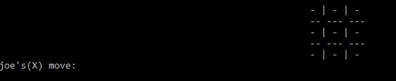
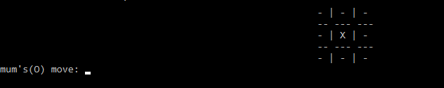
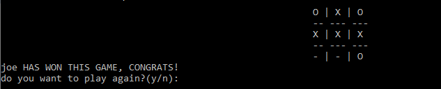

# TicTacToe
A simple tictactoe game made in c++

<center>

<br>


<br>

</center>

# Functionality
Currently you can only play 2 player mode and Human v/s Robot in this. Soon i'll be adding:
- [ ] Human v/s robot
- [ ] Multiplayer mode


# Installation
To use this game,
+ Clone this repository by typing ```git clone https://github.com/gauravmittal54/tick-tack-toe-game.git```
+ Open any of the code editor and run the ```main.cpp``` file.

